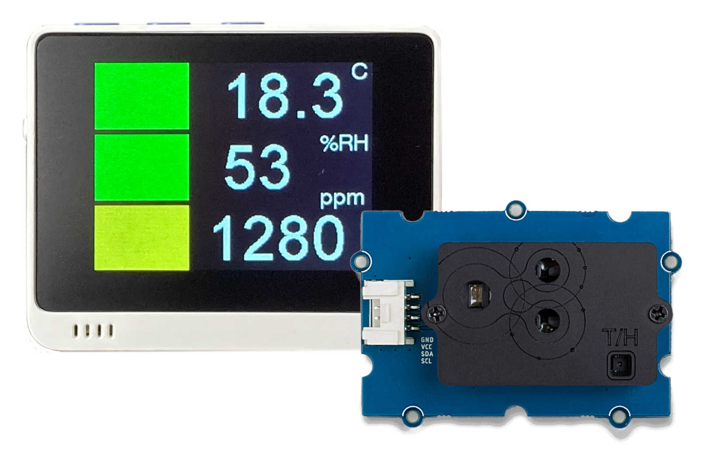

# CO2 Checker for Wio Terminal

 

 

(TODO)

## 必要なパーツ

* [Wio Terminal](https://www.seeedstudio.com/Wio-Terminal-p-4509.html)
* [Grove - CO2 & Temperature & Humidity Sensor for Arduino (SCD30) - 3-in-1](https://www.seeedstudio.com/Grove-CO2-Temperature-Humidity-Sensor-SCD30-p-2911.html)

## 動かし方

### ハードウェアの組み立て

(TODO)

### Wi-Fiモジュールのファームウェアを更新

(TODO)

### アプリケーションをインストール

(TODO)

### Wio Terminalをコンフィグモードで起動

(TODO)

### Wi-Fi接続情報を設定

(TODO)

### Azure IoT接続情報を設定

(TODO)

### Wio Terminalを再起動

(TODO)

## ライセンス

[MIT](LICENSE.txt)
